# EOD Tracker

<p align="center">
  
</p>

<p align="center">
  <strong>A lightweight Windows desktop app for tracking daily tasks and exporting a filled Excel EOD report — built for the CodeClouds dev team.</strong>
</p>

<p align="center">
  
  
  
  
  
</p>

---

## What is EOD Tracker?

EOD Tracker is a **system tray app** that lives quietly in your Windows taskbar. Throughout your workday, you add tasks as you complete them. At the end of the day, click **Export to Excel** and get a fully formatted `.xlsx` EOD report — ready to send.

**Key modules:**

| Module | Description |
|--------|-------------|
| **Task Tracker** | Add, timer-track, and manage daily tasks |
| **Client Bookmarks** | Save links, files, PDFs, images, videos, and folders per client — quick-access from the floating button |
| **Gorilla Reminder** | Visual reminder widget shown at a configured time |
| **Excel Export** | One-click export to a pre-formatted EOD Excel template |

---

## Features

- **Floating side button** — a slim pill button anchored to the right screen edge, always visible
- **Slide-in panel** — half-screen-width panel slides in from the right; no separate window
- **Dark & Light themes** — switchable from Settings
- **Task timers** — start/stop timers on individual tasks
- **Client Bookmarks** — per-client data organised by type (Link, Image, File, PDF, Video, Document, Folder)
  - Open links in your browser of choice (Chrome, Firefox, Edge, Brave, Opera)
  - Copy files to clipboard — paste as real files in any app (Explorer, Slack, email)
  - Folders auto-zip on copy
  - Drag to reorder, pin important items
- **System tray** — right-click for quick actions; double-click to open panel
- **Auto-start with Windows** (optional, asked once on first run)
- **Crash logging** to `%APPDATA%\CodeClouds\EODTracker\crash.log`

---

## Screenshots

<p align="center">
  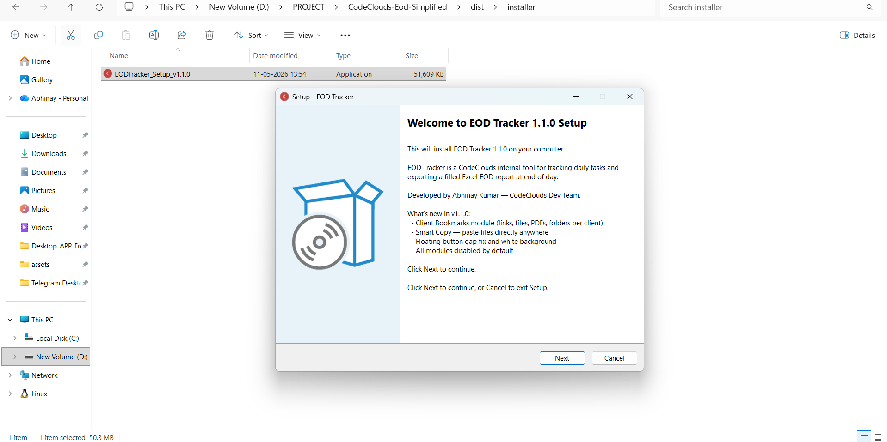
  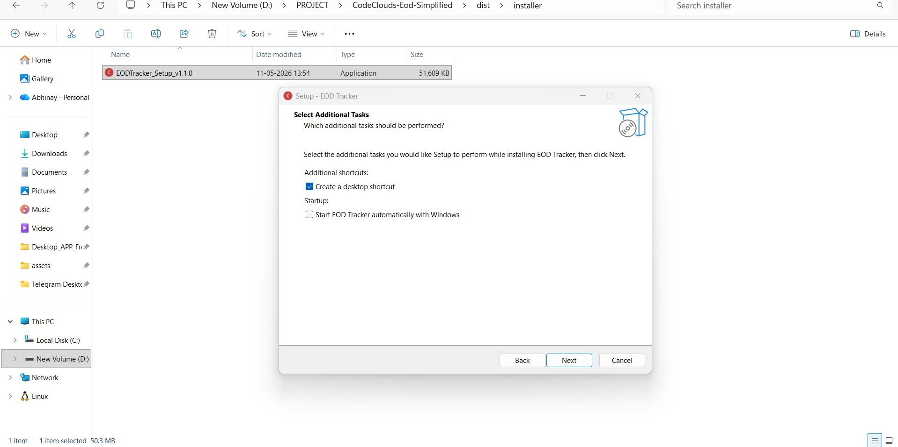
</p>
<p align="center">
  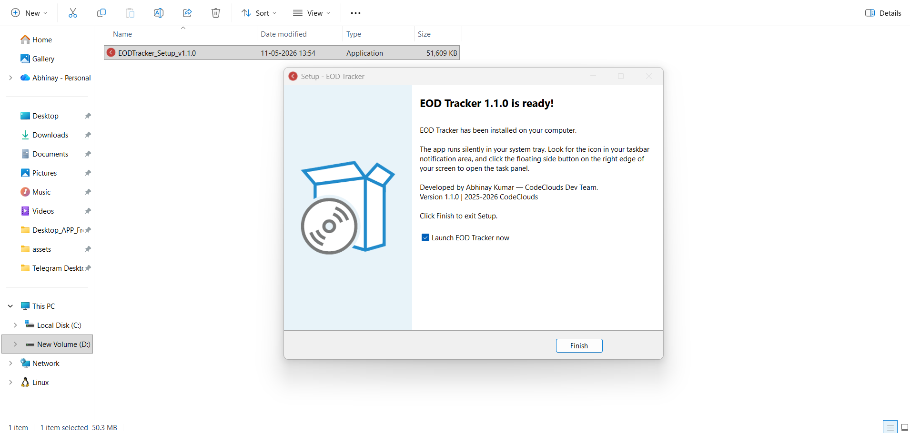
  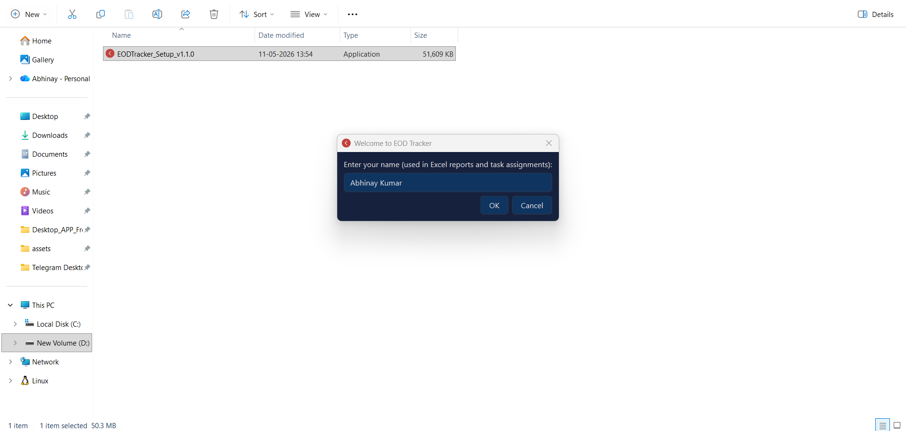
</p>
<p align="center">
  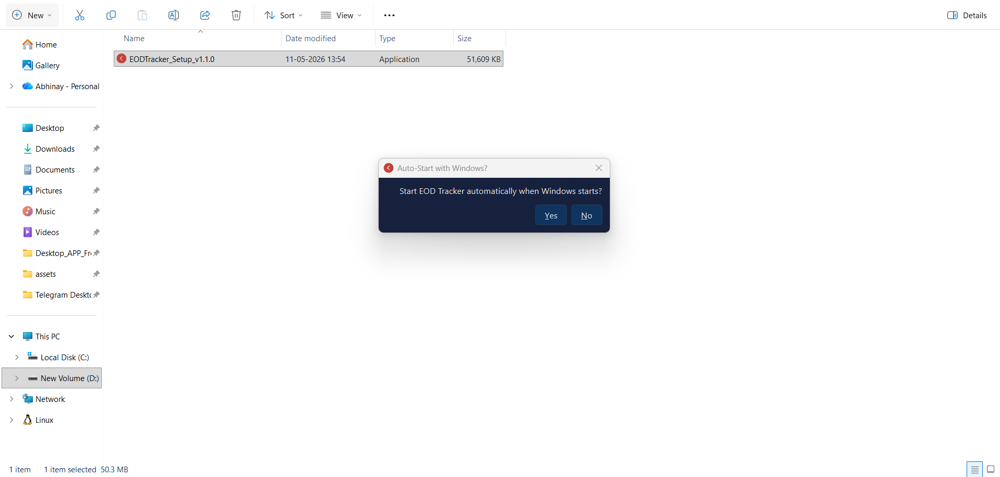
  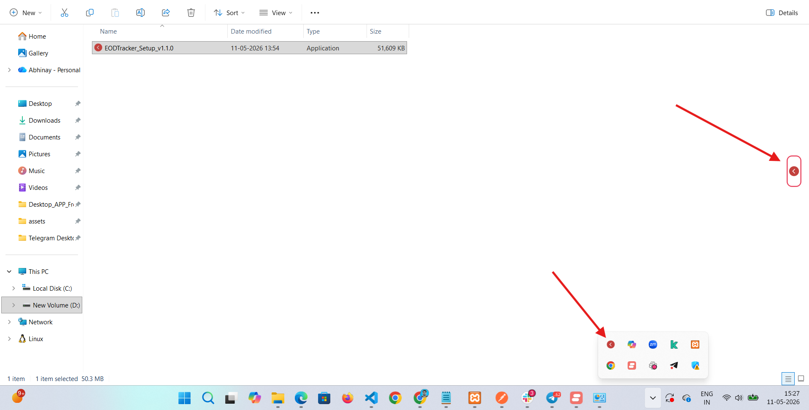
</p>
<p align="center">
  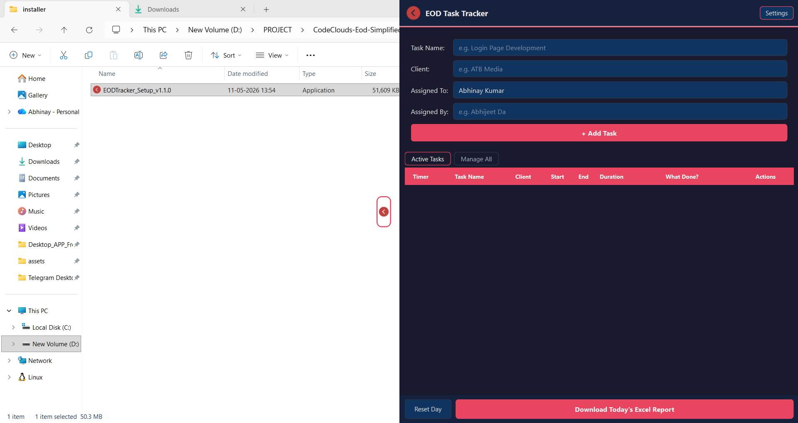
  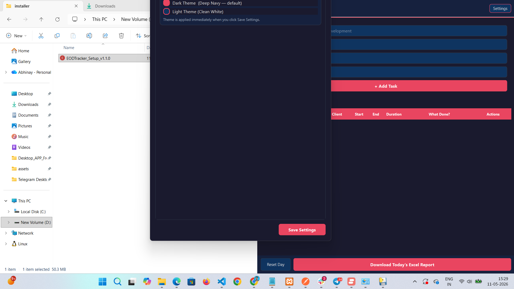
</p>
<p align="center">
  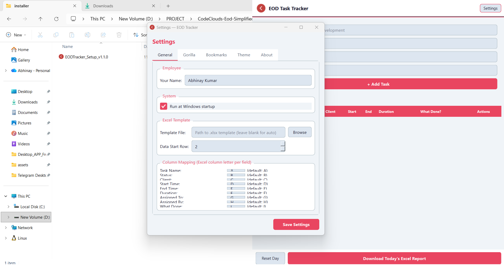
  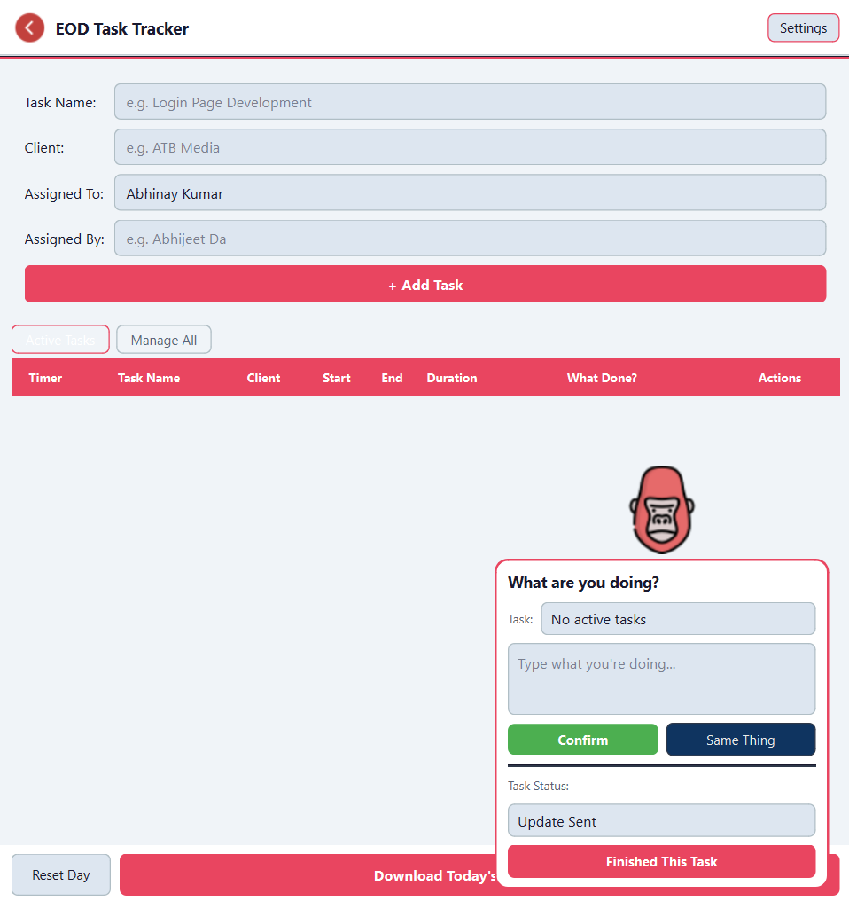
</p>
<p align="center">
  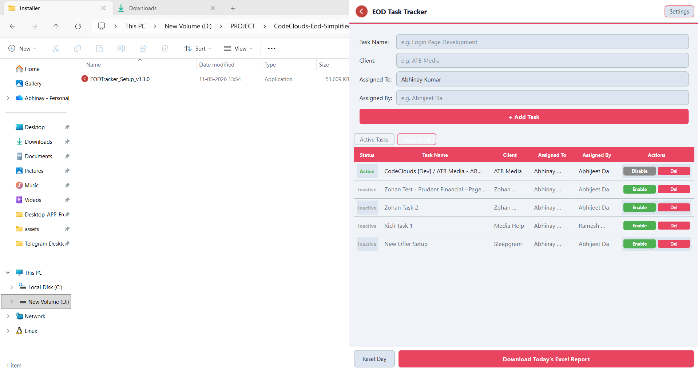
  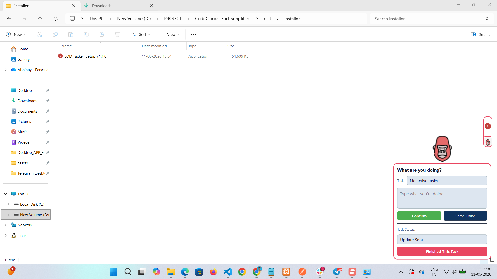
</p>
<p align="center">
  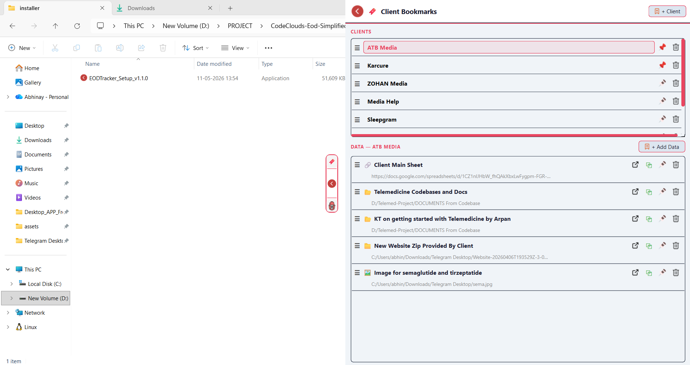
  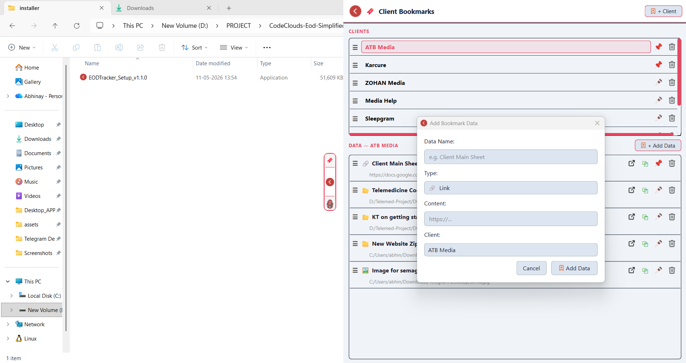
</p>

---

## Demo Video

<!-- Replace YOUR_VIDEO_ID below with your YouTube video ID (the part after ?v= in the URL) -->
<!-- Example: https://www.youtube.com/watch?v=dQw4w9WgXcQ → video ID is dQw4w9WgXcQ -->

[](https://www.youtube.com/watch?v=YOUR_VIDEO_ID)

---

## Installation

### Option A — Installer (recommended)

1. Download **`EODTracker_Setup_v1.1.0.exe`** from [Releases](https://github.com/abhi-cop-dev10/eod-tracker/releases)
2. Run the installer — no admin rights required
3. Choose whether to create a desktop shortcut and/or auto-start with Windows
4. Click **Launch EOD Tracker** on the final screen

The app starts in your system tray. Look for the floating button on the **right edge of your screen**.

### Option B — Run from source

**Requirements:** Python 3.10+, Windows

```bash
git clone https://github.com/abhi-cop-dev10/eod-tracker.git
cd eod-tracker
pip install -r requirements.txt
python main.py
```

---

## How to Use

### First Run
- Enter your **name** when prompted — used in Excel reports and task assignments
- Choose whether to auto-start with Windows

### Adding Tasks
1. Click the **floating button** on the right edge of your screen to open the panel
2. Click **+ Add Task** to log a completed or in-progress task
3. Fill in task name, project, time spent, and notes
4. Start/stop the built-in timer if needed

### Exporting EOD Report
1. Open the task panel
2. Click **Export to Excel**
3. A pre-filled `.xlsx` report is saved and opened automatically

### Client Bookmarks
1. Go to **Settings → Bookmarks** and enable the module
2. Click the **bookmark button** (top of the floating pill) to open the Bookmarks panel
3. Add clients, then add items per client — links, files, folders, PDFs, images, videos
4. Click the **open** icon to launch, or the **copy** icon to copy to clipboard

### Settings
Right-click the tray icon → **Settings**, or open from inside the panel:

| Tab | Options |
|-----|---------|
| General | Employee name, theme (dark/light) |
| Gorilla | Enable/disable, set reminder time |
| Bookmarks | Enable/disable module |
| Theme | Dark / Light toggle |
| About | Version and developer info |

### Uninstalling
Go to **Windows Settings → Apps → EOD Tracker → Uninstall**.
You will be asked whether to delete your saved data (tasks, bookmarks, settings). Choosing **No** keeps your data intact.

---

## Building from Source

### Build EXE

```bash
pip install pyinstaller pillow
py -m PyInstaller --onefile --windowed --name=EODTracker --icon="assets/tray_icon.ico" --add-data="assets;assets" --add-data="templates;templates" --hidden-import=openpyxl --hidden-import=sqlite3 --hidden-import=app.bookmarks main.py
```

Output: `dist\EODTracker.exe`

### Build Installer

Requires [Inno Setup 6](https://jrsoftware.org/isdl.php).

```bash
"C:\Program Files (x86)\Inno Setup 6\ISCC.exe" installer\setup.iss
```

Output: `dist\installer\EODTracker_Setup_v1.1.0.exe`

---

## Project Structure

```
eod-tracker/
├── main.py                  # Entry point
├── requirements.txt
├── EODTracker.spec          # PyInstaller spec
├── installer/
│   └── setup.iss            # Inno Setup installer script
├── assets/                  # Icons and images (16×16 PNGs)
│   ├── tray_icon.png
│   ├── tray_icon.ico
│   ├── pin.png / pinned.png
│   ├── remove.png
│   ├── launch.png
│   ├── add.png
│   ├── gorilla.png
│   └── ...
├── templates/
│   └── eod_template.xlsx    # Excel report template
└── app/
    ├── database.py          # SQLite CRUD (tasks, settings, bookmarks)
    ├── floating_panel.py    # FloatingButton + FloatingPanel (main UI shell)
    ├── bookmarks.py         # Client Bookmarks panel
    ├── task_form.py         # Task add/edit form
    ├── task_table.py        # Task list with timers
    ├── excel_export.py      # Excel EOD export logic
    ├── gorilla.py           # Gorilla reminder widget
    ├── settings.py          # Settings window
    ├── themes.py            # Dark/light stylesheet builder
    ├── tray.py              # System tray integration
    ├── toast.py             # Toast notification helper
    ├── paths.py             # Cross-platform path helpers
    └── icon_utils.py        # App icon loader
```

---

## Data Storage

All user data is stored locally at:

```
%APPDATA%\CodeClouds\EODTracker\
├── tasks.db       # SQLite database (tasks, bookmarks, settings)
└── crash.log      # Crash log (overwritten on each crash)
```

No data is sent externally. Everything stays on your machine.

---

## Tech Stack

| Library | Purpose |
|---------|---------|
| [PyQt6](https://pypi.org/project/PyQt6/) | UI framework |
| [openpyxl](https://pypi.org/project/openpyxl/) | Excel read/write |
| sqlite3 | Local database (stdlib) |
| [PyInstaller](https://pyinstaller.org/) | Package to `.exe` |
| [Inno Setup](https://jrsoftware.org/isinfo.php) | Windows installer |

---

## Developer

**Abhinay Kumar** — CodeClouds Dev Team
Internal tool — not for public distribution.

---

## Changelog

### v1.1.0
- Added **Client Bookmarks** module (links, files, images, PDFs, videos, folders per client)
- Smart Copy: links copy as text; files copy as real clipboard files (paste anywhere); folders auto-zip
- Floating button: bookmark button at top, white background, no colour change on active state
- All modules (Gorilla, Bookmarks) disabled by default
- Fixed floating button gap from screen edge
- Proper Windows installer with uninstall data-deletion prompt

### v1.0.0
- Initial release: task tracker, Excel EOD export, system tray, dark/light theme
